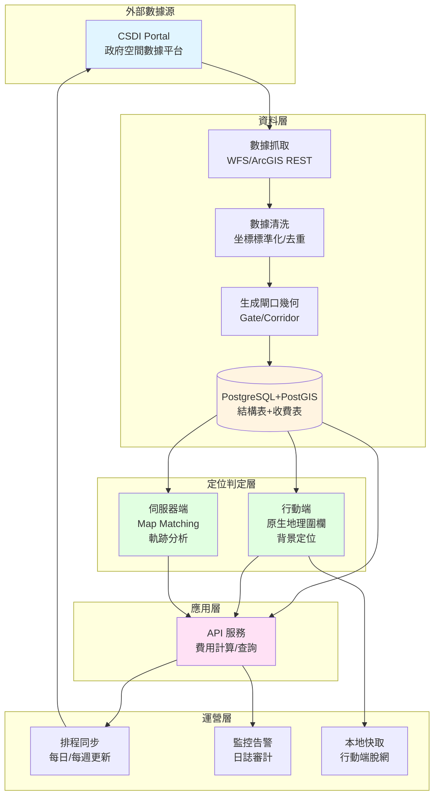
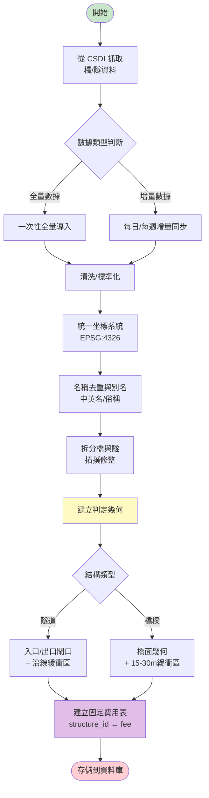
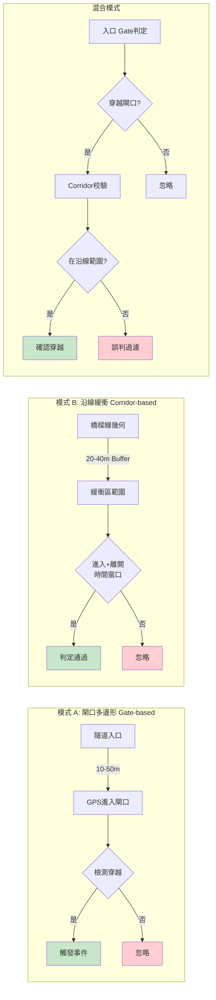
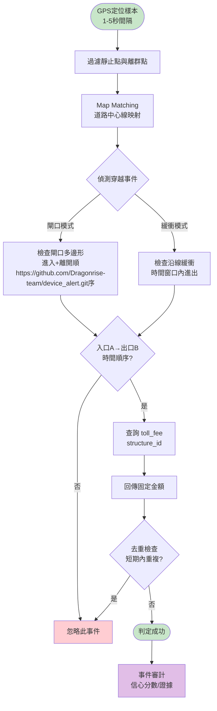
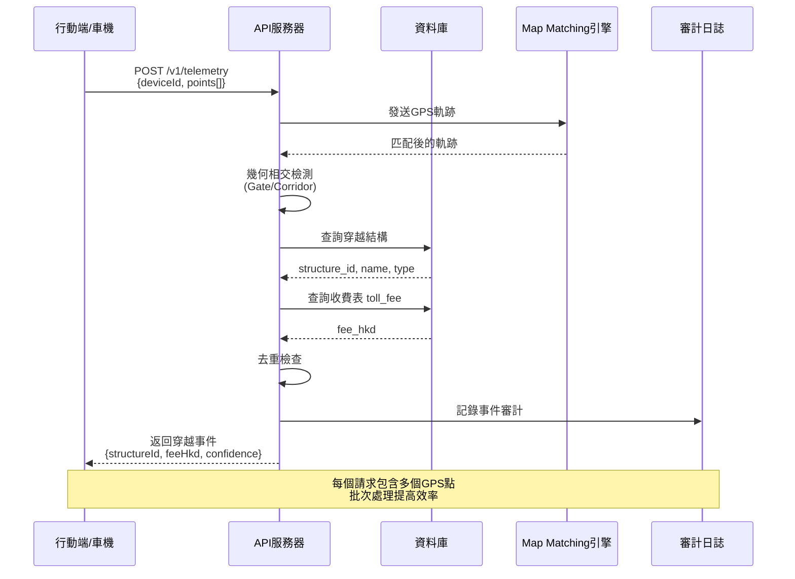
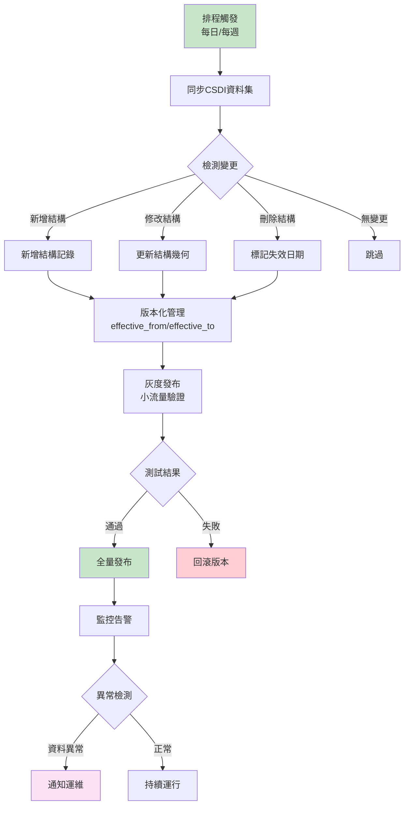
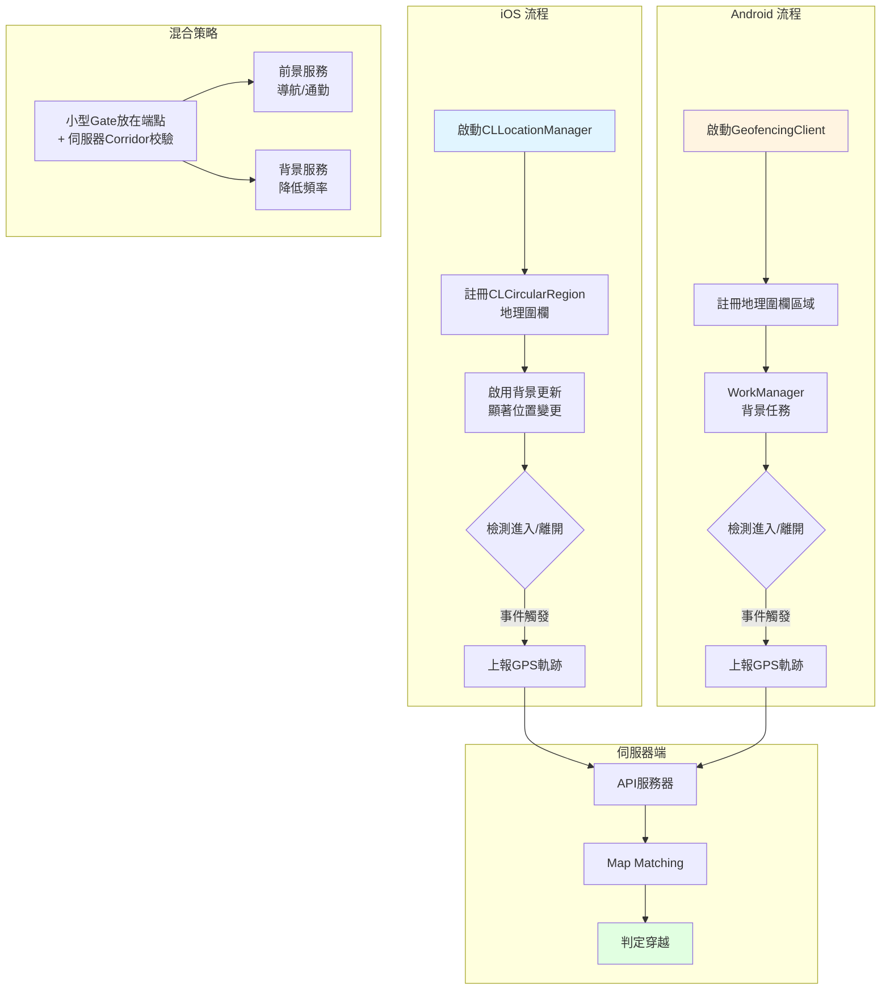
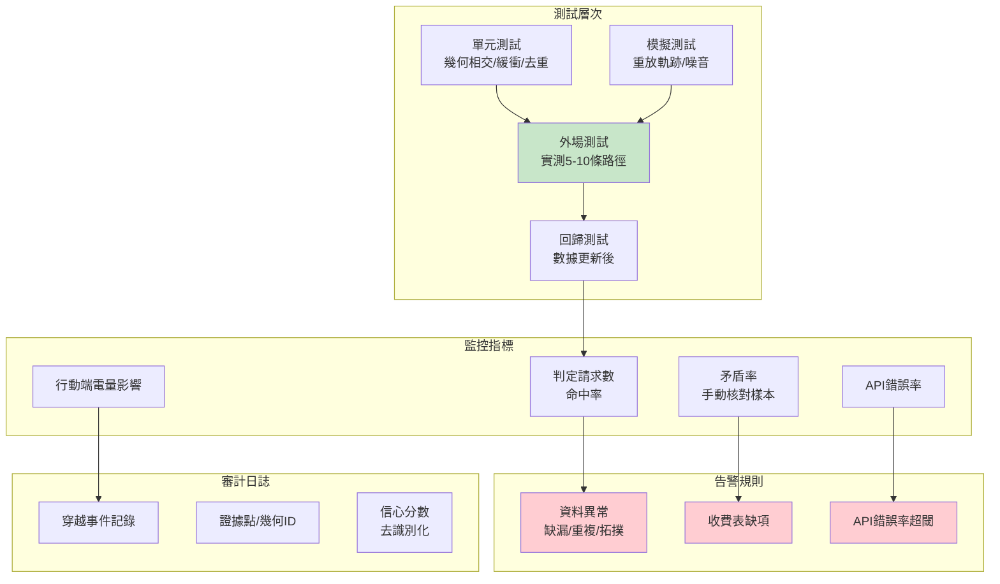
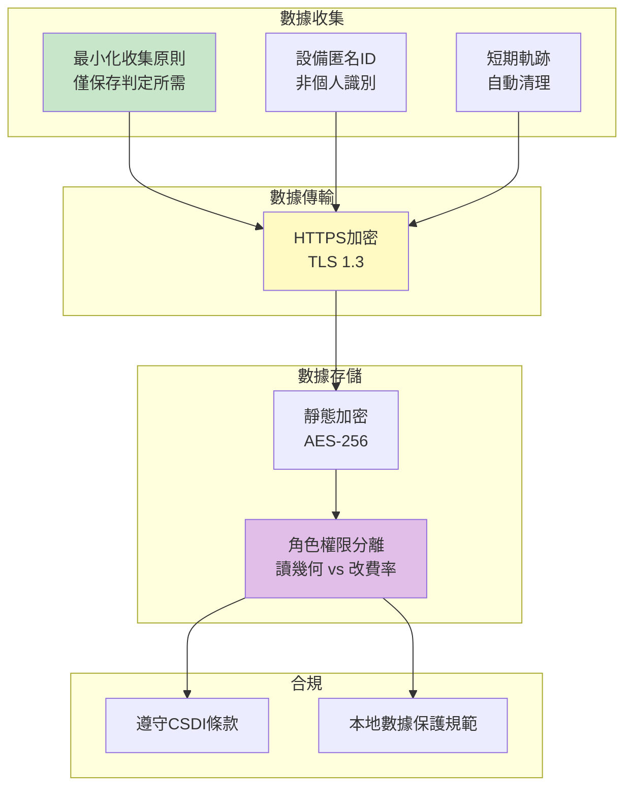
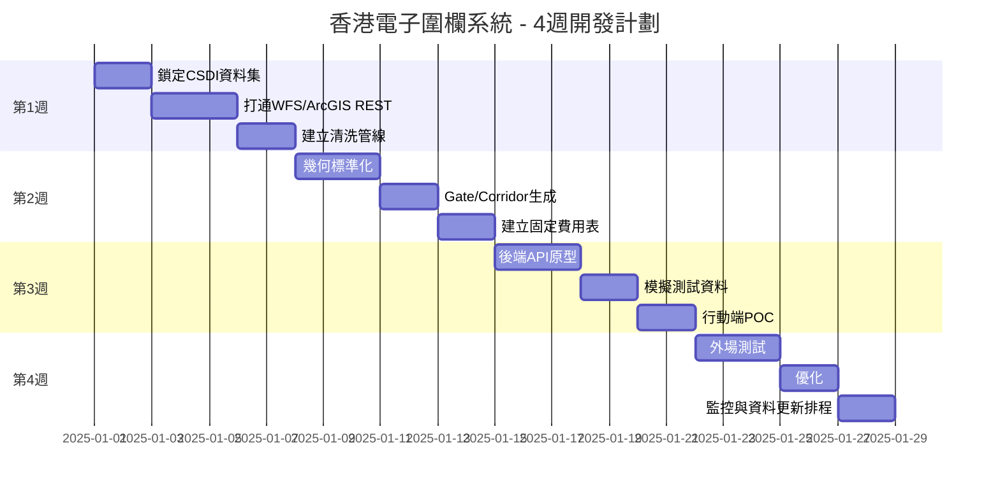

# 香港電子圍欄系統 - 架構流程圖

> 參考 README.md 中的完整系統設計

---

## 1. 系統整體架構流程

---

## 2. 地理資料處理流程

---

## 3. 電子圍欄建模策略

---

## 4. 判定流程（高層邏輯）

---

## 5. 後端 API 請求流程

---

## 6. 資料更新與維運流程

---

## 7. 行動端整合流程

---

## 8. 測試與監控流程

---

## 9. 安全與隱私流程

---

## 10. 初始里程碑甘特圖

---

## 圖表使用說明

1. **系統整體架構** (圖1): 展示各層次的關係與數據流向
2. **地理資料處理** (圖2): 從CSDI數據到判定幾何的轉換流程
3. **電子圍欄建模** (圖3): 三種不同的判定策略比較
4. **判定流程** (圖4): GPS樣本到收費結果的核心邏輯
5. **API請求流程** (圖5): 端到端的請求處理時序
6. **資料更新維運** (圖6): 持續集成的管理流程
7. **行動端整合** (圖7): iOS/Android雙平台的實施方案
8. **測試與監控** (圖8): 質量保障體系
9. **安全與隱私** (圖9): 合規性要求
10. **開發里程碑** (圖10): 4週快速迭代計劃

---

## 技術棧建議

- **資料庫**: PostgreSQL + PostGIS
- **幾何運算**: JTS/GEOS/Turf.js
- **Map Matching**: Valhalla/OSRM 或自建簡化版
- **開發語言**: Node.js/Go/Python
- **GIS工具**: QGIS/ArcGIS Pro
- **監控**: Prometheus + Grafana

---

_最後更新: 2025-01-30_

